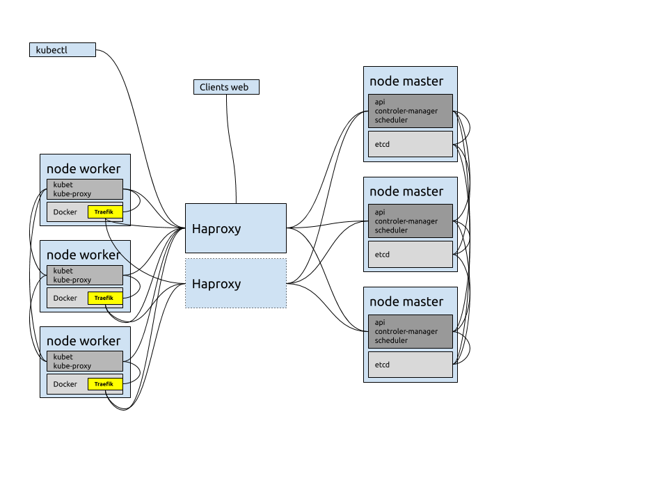

# Cluster k8s HA

Depuis le projet initial [k3s-ha-etcd](https://github.com/jthiry50/k8s-ha)

## Description du projet

**Remarque:** Ce projet est un POC. Le code et l'implémentation sont améliorables.

En se basant sur les projets et documentations:

* [K3S Ansible](https://github.com/rancher/k3s-ansible)
* [Kubernetes The Hard Way](https://github.com/kelseyhightower/kubernetes-the-hard-way)
* [Exemple Haproxy](https://gitlab.com/xavki/presentations-kubernetes/-/tree/master/37-kubspray-haproxy)
* [Installation Traefik](https://blog.wescale.fr/2020/03/06/traefik-2-reverse-proxy-dans-kubernetes/)

L'objectif est de créer un cluster haute disponibilité Kubernetes.

Dans ce code, 8 serveurs sont utilisés avec les caratéristiques suivantes:

* CentOS 7
* 1 CPU par serveur
* 1G de RAM par serveur

3 serveurs seront utilisés pour

* La base de données etcd 3.x en cluster et haute disponibilité + connexions client/serveur/peer en TLS.
* Le Controle Plane Kubernetes k8s se connectant au cluster etcd.
* Les instances de master k8s ne seront pas visibles dans la liste des nodes.

3 serveurs seront utilisés pour

* Node k8s utilisant Docker
* Installation de kubelet, kube-proxy et flannel

2 serveurs seront utilisés pour

* Haproxy qui va loadbalancer en TCP les nodes master
* Haproxy va aussi loadbalancer en TCP d'ingress controler Traefik
* Keepalived pour maintenir une IP virtuelle
* 1 serveur actif, 1 serveur passif

Après installation du cluster, les POD disponibles seront:

* Flannel
* CoreDNS
* Traefik



## Lancement des Playbooks Ansible

Ce projet fonctionne sur **Ansible version 2.9**

Avant de lancer, se connecter sur les 8 serveurs via SSH avec une clé SSH ne demandant pas de mot de passe (sans passphrase ou ssh-agent)

Fonctionne uniquement sur **CentOS 7**

### Préparation de l'inventaire

Adapter le fichier `inventory/inventory.ini` pour y mettre les bonnes adresse IP. Changer aussi le fichier `inventory/group_vars/all.yml` pour mettre l'adresse IP virtuelle d'Haproxy.

Lancer le premier playbook

```bash
ansible-playbook 00-prereq.yml
```

Puis reboot des serveurs pour appliquer les changements SELinux

Installer etcd

```bash
ansible-playbook 01-etcd.yml
```

Installer les nodes master k8s

```bash
ansible-playbook 02-k8s-masters.yml
```

Installer Haproxy et Keepalived

```bash
ansible-playbook 03-haproxy.yml
```

Installer les nodes worker k8s

```bash
ansible-playbook 04-k8s-workers.yml
```

Si on souhaite tout supprimer pour repartir de zéro

```bash
ansible-playbook 99-delete-datas.yml
```
